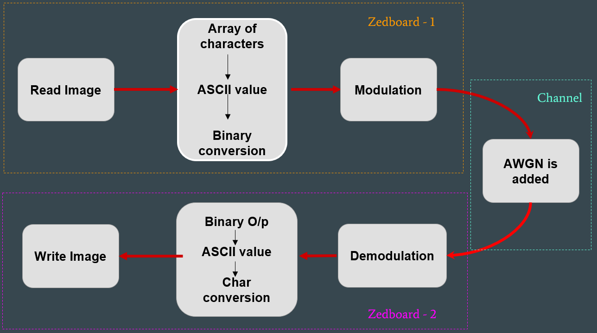
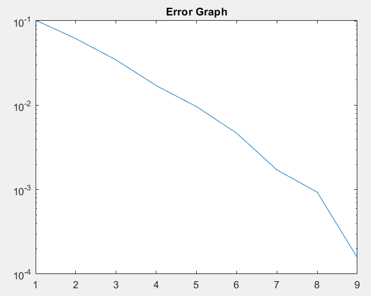

# Image-Transmission-Using-64-QAM
Transfer Image over wired and wireless channel using 64 QAM

Video Link - https://youtu.be/-MvTl2pfDNA
## Introduction

Modulation is a process to transmit message signal. There are various digital  modulation techniques like QPSK, 16-QAM, 64-QAM that are used in communication systems for image transmission. The performance of a system is acceptable at a certain level of noise. If the level of noise is increased, the performance may get disturbed. By using 64 QAM modulation technique, which carries higher data rates, this is essential for the image transmission. Modulation technique such as 64 QAM perform better than QPSK and 16 QAM techniques. 64-QAM is a higher order modulation technique, which allows one signal to represent six bits of data by manipulating the amplitude and phase of the signal into one of 64 different discrete and measurable states.

## General Work Flow

## Matlab Implementation
Run the "compare.m" file in Matlab folder. It will re-generate different images for different SNR values. Following is the error graph for different SNR values.

## C++ Implementation
Run the main.cpp file. It will modulate-->generate noise-->add noise -->demodulates.

This project waas further implemented on zedboard.

## Status - Completed
Both C++ code and MATLAB code are available and working. The final C++ code was implmennted over zedboard where images were sent wirelessly to another zedboard.
